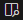
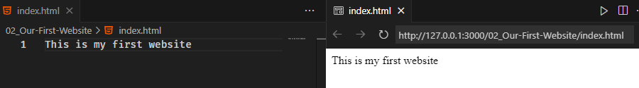

# Our First Website

### Steps for Creating and Previewing Your First HTML Website

1. **Set Up an Editor**: Download an IDE like **Visual Studio Code** (preferred for snippets and suggestions) or use Notepad for basic learning.
2. **Create an HTML File**: Make a file (e.g., `index.html`) with the `.html` extension.  
3. **Write HTML**: Add the following line:
   ```html
   This is my first website
   ```  
4. **Preview in VS Code**:  
   - Install the **Live Preview** extension in VS Code.  
   - Click the preview icon () at the top-right corner to view the output.  
5. **Open in Browser**: Copy the preview link and paste it into your favorite browser to view the website.  

Output in VS Code:  
  

## Why Use HTML Tags Instead of Plain Text?

Great question! While it's true that you can write plain text directly into an HTML file and it will render in a browser, **using tags is essential** for several reasons:

1. **Structure and Semantics**: Tags like `<h1>` for headings and `<p>` for paragraphs add meaning and structure, making the content readable by search engines and assistive tools.
   - Example:  
     Without tags:  
     ```html
     This is a heading
     This is a paragraph
     ```  
     With tags:  
     ```html
     <h1>This is a heading</h1>
     <p>This is a paragraph</p>
     ```

2. **Styling and Design**: Tags allow targeted styling using CSS, enabling you to change the look of specific elements.
   -  For instance:
		```css
		p { color: blue; }
		```

3. **Accessibility**: Tags like `` with `alt` attributes and `<nav>` enhance accessibility for users relying on screen readers.

4. **Interoperability**: Tags ensure consistency across browsers and platforms by adhering to web standards.

5. **Search Engine Optimization (SEO)**: Tags like `<title>`, `<meta>`, and `<h1>` help search engines index your website properly.

6. **Reusable Components**: Tags enable modular and reusable components with CSS frameworks or JavaScript libraries.

In summary, while plain text works in simple cases, **tags are vital** for structure, interactivity, and usability in modern web development.
